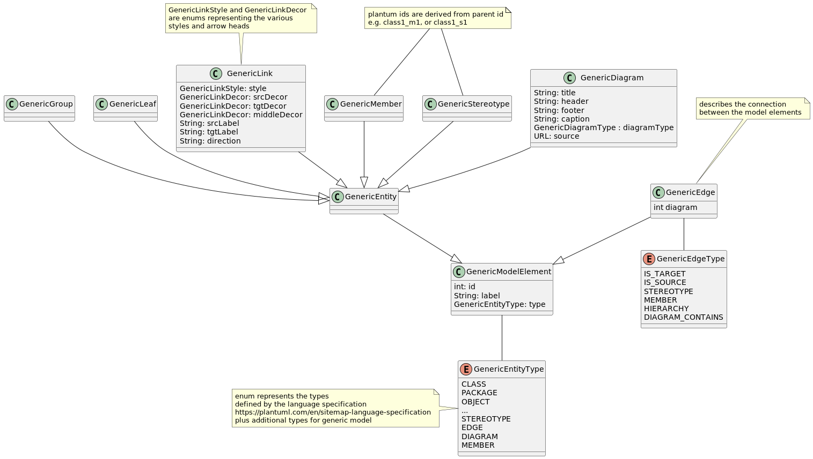

# Generic Diagram

## Purpose 

* create a model of the entities and relations described in the plant uml
  * just info on entities and their connections
  * without UML semantics
* can be serialized into e.g. graphML and then processed and interpreted by 
	additional tools 
 

## Approach

We use the plantUML internal representation 
`net/sourceforge/plantuml/baraye/CucaDiagram`, which is results from parsing 
and processing the plantUML syntax as basis for the output. 

### Intermediate POJO Datamodel  
* create a POJO model of the plantUML contents -> Package `genericdiagram.data`
* Design of the POJO Model 
  * Data classes that 
    * represent cuca elements `GenericDiagram, GenericEntity,
      GenericGroup, GenericLeaf, GenericLink` 
    * Some UML specifics `GenericMember, MemberVisibility, GenericStereotype`
  * enums to describe types 
    * the different plantUML entities `GenericEntityType`
    * the different graph types `GenericDiagramType`
  * enums to describe the links drawn in plantUML
    * `GenericLinkDecor, GenericLinkStyle`

* see  

Rationale: 

* the POJO defines a data model that can be re implemented e.g. in
	python or other languages, that may want to consume the generic export
* We are independent of the export format and can create other graph 
	incarnations besides graphml easily 

## Nodes and Edges Design 

* We uses nodes and edges
* nodes are  `GenericDiagram, GenericEntity,
  GenericGroup, GenericLeaf, GenericLink, GenericMember, GenericStereotype`
* nodes map to cuca elements 
* edges are `GenericEdge`
* edges do not map to cuca elements but describe relations between them
* edges have different types to describe the semantics of the edge 
  `GenericEdgeType`
  * `MEMBER, STEREOTYPE` to describe the ownership of members and 
    stereotypes  
  * `HIERARCHY` to describe parent-child relations
  * `IS_SOURCE, IS_TARGET` to describe source and targets of links
* We use integers as IDs of nodes; integers are incremented while 
	processing a 	plantUML file. Consequently they are only unique per 
	processed file 
* We add a property type to the serialization of the objects, so that 
  consumers of the model can instantiate corresponding data classes for 
  type safety 
* I added to data model implementations to keep things together 
  * `SimpleGenericModel` a POJO with members for leafs, groups, etc
  * `SimpleGenericGraphModel` a POJO with a node list and a edge list member
   
* I defined two interfaces
  * `IGenericModelCollector` --> used by converter to drop off the data 
		object created
  * `IGenericDiagramVisitor` --> allows to consume the generic model, e.g 
		various exporters may implement this as shown by `graphml.GraphMLExporter` 
 
Rationale 
* using representing links as nodes is counterintuitive, but this gives 
	the ability to add new relations without changing the data objects
* The visitor pattern gives flexibility in transforming the generic model 
	into different exports or convert between different 
	implementations of the generic datamodel 

## The Unique Name Problem

Using plantUML we don't have unique IDs like the UUIDs used in typical UML 
Tools to uniquely identify elements across diagrams. Adding them in the 
post-processing step would not help, as we can't easily relate the items 
across different files. 

To be able to merge model elements from different plantUML files of a 
project we introduce a *fullyQualifiedPumlID*.

* all elements have an diagram unique id `pumlId`, e.g. cl0002 or LNK4
* a plantUML file can have a file can have multiple `@startuml..@enduml` 
	blocks, we count them zero based -> `blockCount`
* each puml file has a `filePath`
* we assume that multiple puml files that are part of a project have a 
	common  `rootPath`, e.g. the top folder after checkout from git

The `fullyQualifiedPumlId` is defined as (`filePath` minus `rootPath`)
`/blockCount/pumlId`. It should be unique across all model elements within a 
common project scope. 

Example: 
* `filePath` is `/home/myuser/git/myproject/src/path/to/file.puml`
* `rootPath` is `/home/nyuser/git/myproject/`
* file comprises a single block -> `blockCount = 0`
* `fullyQualifiedPumlId = ./src/path/to/file.puml/0/cl0002`

## Why not adding UML semantics to the graphML Export? 

Since plantUML carries the name plantUML it may be counterintuitive to not 
add UML semantics to the export. 

Rationale: 

There exist several extensions in the plantuml stdlib that aim at having 
different semantics. Exporting to a generic format should allow for a 
subsequent semantic interpretation step. 

## Processing of the Cuca Diagram 

* Uses visitor pattern `ICucaDiagramVisitor` -> allows to 
	add other exports or data formats
* interfaces are defined in `genericdiagram.cucaprocessing`
* the wrapper interfaces `ICucaXxxxWrapper` are introduced to not affect the 
	original 
	implementation classes of the `CucaDiagram` 
* main implementation class of the conversion is `genericdiagram.
	cucaprocessing.impl.Cuca2GenericConverter`. 
* A good starting point for debugging understanding is `visitCucaDiagram
	(ICucaDiagramWrapper diagram)`

## GraphML Export 

* GraphML has the following options to add information to the nodes 
  * [data-key](http://graphml.graphdrawing.org/primer/graphml-primer.html#Attributes) 
  * [adding attributes](http://graphml.graphdrawing.org/primer/graphml-primer.html#AttributesExt)
  * [adding complex objects](http://graphml.graphdrawing.org/primer/graphml-primer.html#Complex)
* The latter two options require XML schemata... I don't want to dive into 
	this, so I started with data key lookup as choice for adding attributes
* `graphml.GraphMLExporter`

## JSON Export (not supported) 

* To avoid additional dependencies of plantUML (e.g. [FasterXML
	](https://github.com/FasterXML/jackson) the JSON export is currently not 
	implemented
* One may add this later by creating a simple JSON exporter implementing the 
	`IGenericDiagramVisitor` interface

